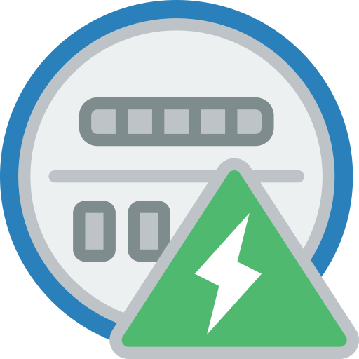

  

# Home Assistant - Meter Parser Integration
[![BuyMeCoffee][buymecoffeebadge]][buymecoffee] ![Checks][checksbadge]
![Last release][releasebadge] [![Hacs][hacsbadge]][hacs] [^1]

This is a custom component to allow parse of dial and digits utility meters like water, gas, and electricity to provide energy consumption information to home assistant using a regular ip camera.

This repository is under alpha stage, so expect bugs and breaking changes.

### Highlights of what **Meter Parser** can do

* Parse Meters
* Provide a consumption sensor of `total_increasing` state type.
* Cheap IP or PoE cameras must do

### Potential Downsides

* Positioning a camera and getting a good image could be difficult.
* Could be hard to setup calibration parameters, such as `zoom_factor`.
* To recognize digits, I am relying on OCR services on the internet. I am open to 
suggestions on better local libraries to scan digits. Recognizing dials is simple and local,
no internet connection or APIs are required.

## Installation (HACS) - Highly Recommended

1. Have HACS installed, this will allow you to easily update
2. Add [https://github.com/junalmeida/ha-meterparser](https://github.com/junalmeida/ha-meterparser) as a custom
   repository as Type: Integration
3. Click install under "Meter Parser Integration" in the Integration tab
4. Add your meter to your `configuration.yaml` file as shown below
5. Restart HA


## Usage

* Entities will show up as `sensor.<friendly name>`, for example (`sensor.water_meter`).
* Setup you camera and sensor in `configuration.yaml`
```yaml
# Example configuration.yaml entry
sensor:
  - platform: meter_parser
    scan_interval: 60 # in seconds, higher intervals is better to avoid rate limits
    source:
      - name: Water Meter
        entity_id: camera.water_meter # any camera entity
    meter_type: digits # digits or dials, at this moment, digits uses internet to ocr.
    ocr_space_key: "123456789" # required for digits, grab a key at https://ocr.space/ (watch for rate limits)
    digits: 6 # required for digits, number of expected total digits (including decimals)
    decimals: 1 # optional number of decimals
    debug: True # when true it stores an image with scanned dials
    device_class: water # energy, gas or water
    unit_of_measurement: m³ # m³, ft³, kWh, MWh, Wh, gal, L

  - platform: meter_parser
    scan_interval: 15
    source:
      - name: Electricity Meter
        entity_id: camera.electricity_meter
    meter_type: dials # read out dial pointers, internet is not used.
    dials: ["CCW","CW", "CCW", "CW"] # readout convention (counter clockwise, clockwise)
    dial_size: 280 # minimum expected dial diameter in pixels, this could be hard to figure out, so position your camera, and access with VLC to check the diameter of each dial, then set a minimum with an error margin. 
    debug: True  # when true it stores an image with scanned dials
    device_class: energy # energy, gas or water
    unit_of_measurement: kWh # m³, ft³, kWh, MWh, Wh, gal, L
``` 

## Reporting an Issue

1. Setup your logger to print debug messages for this component by adding this to your `configuration.yaml`:
    ```yaml
    logger:
     default: warning
     logs:
       custom_components.meter_parser: debug
       meter_parser: debug
    ```
2. Restart HA
3. Verify you're still having the issue
4. File an issue in this Github Repository, add logs and if possible an image of your meter.


## Credits
🎉 [Dial Parser](custom_components/meter_parser/parser_dial.py) code is based on the awesome work of [@mirogta](https://github.com/mirogta), please [support his work](https://github.com/mirogta/dial-meter-reader-opencv-py).


[^1]: Icons made by [Smashicons][iconcredit] from [flaticon.com][iconcreditsite]

[iconcredit]: https://www.flaticon.com/authors/smashicons
[iconcreditsite]: https://www.flaticon.com/
[buymecoffee]: https://www.buymeacoffee.com/junalmeida
[buymecoffeebadge]: https://img.shields.io/badge/buy%20me%20a%20coffee-donate-orange?style=plastic&logo=buymeacoffee
[checksbadge]:https://img.shields.io/github/checks-status/junalmeida/ha-meterparser/master?style=plastic
[releasebadge]:https://img.shields.io/github/v/release/junalmeida/ha-meterparser?style=plastic&display_name=tag&include_prereleases
[hacs]:https://github.com/hacs/integration
[hacsbadge]:https://img.shields.io/badge/HACS-Custom-41BDF5.svg?style=plastic